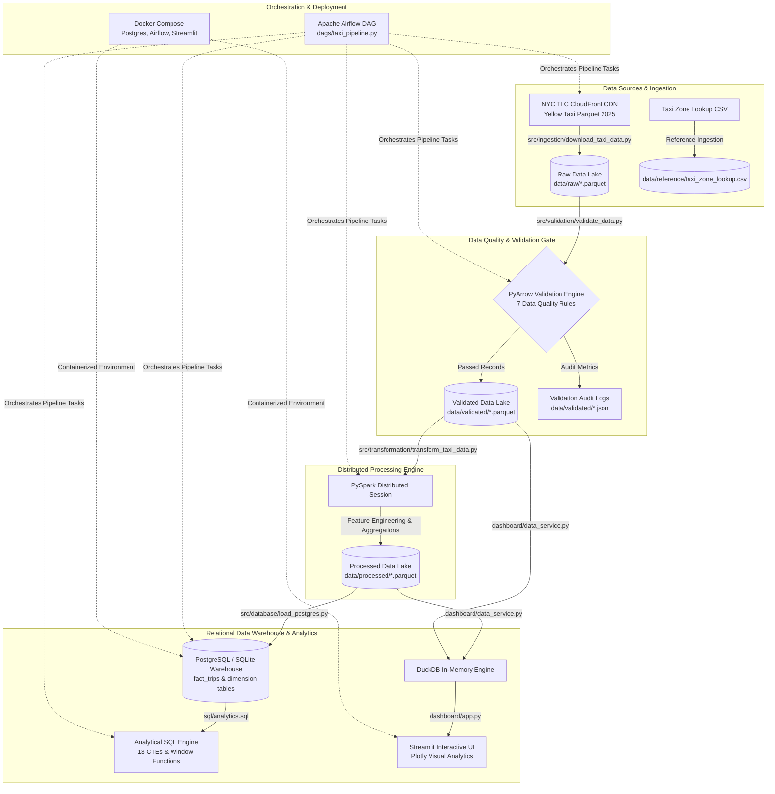
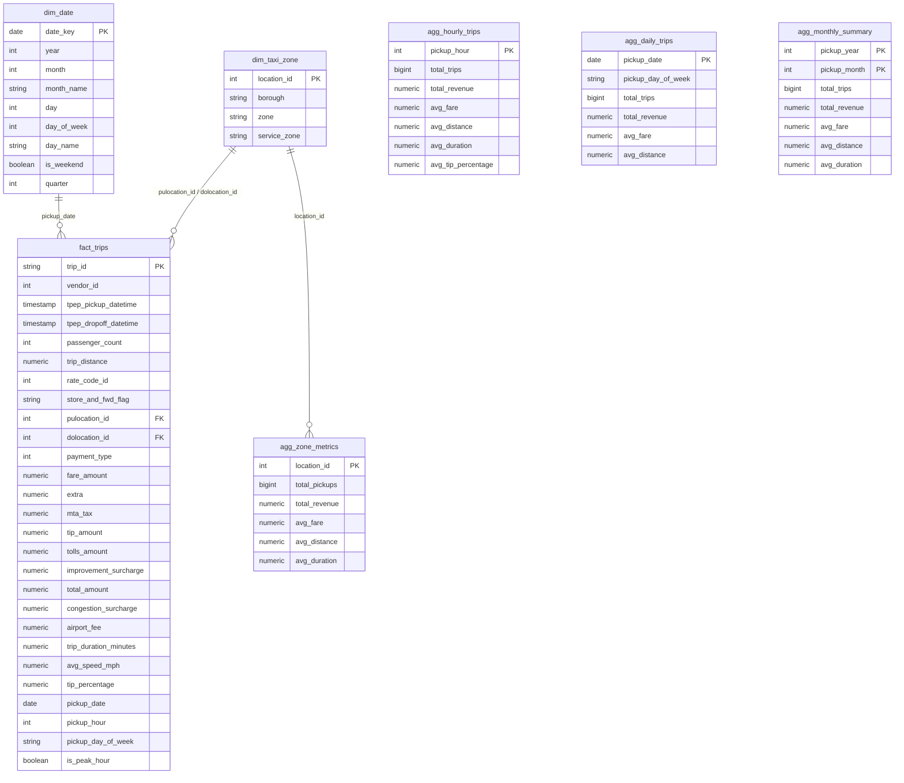

# NYC Yellow Taxi Data Engineering Pipeline & Analytics Portal

An enterprise-grade, end-to-end Data Engineering pipeline and interactive analytics portal that ingests, validates, transforms, stores, and visualizes official **NYC TLC Yellow Taxi Trip Record Data (2025)** using **PySpark**, **PostgreSQL**, **DuckDB**, **Apache Airflow**, **Streamlit**, and **Docker**.

Processes large-scale urban mobility data through a multi-stage ETL architecture—enforcing automated PyArrow quality assertions, building a relational star-schema data warehouse, executing advanced analytical SQL queries, and delivering sub-millisecond in-memory dashboard analytics.

---

## 🚀 Live Demo
🔗 **Public Application URL:** [https://nyc-taxi-data-project.onrender.com](https://nyc-taxi-data-project.onrender.com)

---

## 📊 Project Overview
The **NYC Yellow Taxi Data Engineering Project** analyzes full-year 2025 trip records (**44,182,460 validated trips** generating **$1.28 Billion in gross revenue**) to model urban mobility patterns, revenue performance, spatial demand density, velocity congestion profiles, and tipping dynamics across New York City.

- **Target Audience:** Transportation analysts, urban planners, fleet dispatchers, taxi authorities, and data engineers evaluating large-scale ETL pipeline design, distributed processing, and relational analytics.
- **Main Outputs:**
  - Standardized columnar Parquet data lake storage (raw, validated, and transformed).
  - Production star-schema relational data warehouse (`fact_trips`, `dim_taxi_zone`, `dim_date`, and 4 aggregate summary tables) indexed for analytics.
  - Suite of 13 analytical SQL queries utilizing Common Table Expressions (CTEs) and Window Functions.
  - Automated 6-stage Apache Airflow DAG orchestrating end-to-end pipeline execution.
  - High-performance 4-page Streamlit analytics portal powered by DuckDB in-memory SQL execution.

---

## 🏗️ Architecture



---

## 🔄 Data Pipeline

The pipeline follows a modular 6-stage execution flow:

1. **Data Ingestion (`src/ingestion/download_taxi_data.py`):** Downloads official 2025 monthly Yellow Taxi Parquet datasets and the Taxi Zone Lookup reference file from NYC TLC CloudFront CDN with automated retry logic and file verification.
2. **Data Quality & Validation (`src/validation/validate_data.py`):** Reads raw Parquet files via PyArrow/Pandas and applies 7 data quality checks. Validated rows are written to `data/validated/`, while rejection metrics and check details are saved to JSON logs.
3. **PySpark Distributed Transformation (`src/transformation/transform_taxi_data.py`):** Spawns a PySpark session to engineer derived columns (`trip_duration_minutes`, `avg_speed_mph`, `tip_percentage`, date/time features, `is_peak_hour`) and generates pre-aggregated datasets (`agg_hourly`, `agg_daily`, `agg_monthly`, `agg_zone`). Outputs are stored in `data/processed/`.
4. **Relational Warehouse Loading (`src/database/load_postgres.py`):** Instantiates the relational schema (`sql/schema.sql`) and indexes (`sql/indexes.sql`), loading dimension tables (`dim_taxi_zone`, `dim_date`), fact records (`fact_trips`), and pre-aggregated summaries into PostgreSQL (or local SQLite fallback).
5. **Analytical SQL Execution (`sql/analytics.sql`):** Runs 13 SQL queries against the warehouse using window functions, `GROUP BY` rollups, and CTEs to produce executive reporting data.
6. **Dashboard & In-Memory Analytics (`dashboard/app.py` & `dashboard/data_service.py`):** Renders an interactive 4-page Streamlit portal. Employs DuckDB over Parquet files for sub-millisecond query performance on full 2025 data.

---

## 🗄️ Database

### Warehouse Schema Design
The project implements a Star Schema data warehouse architecture optimized for analytical query workloads.



### Database Optimization (`sql/indexes.sql`)
- **Single-Column B-Tree Indexes:** `tpep_pickup_datetime`, `pickup_date`, `pulocation_id`, `dolocation_id`, `payment_type`, `pickup_hour`.
- **Composite Indexes:** `(pulocation_id, pickup_date)` and `(pulocation_id, dolocation_id)` for route analytics.

---

## 📡 Data Sources

| Source Name | Dataset / Resource | Description | Official URL |
| :--- | :--- | :--- | :--- |
| **NYC TLC Data Store** | Yellow Taxi Trip Records (2025) | Monthly Parquet files containing official raw trip records, timestamps, distances, itemized fares, and location IDs. | [NYC TLC Trip Data](https://d37ci6vzurychx.cloudfront.net/trip-data) |
| **NYC TLC Reference** | Taxi Zone Lookup CSV | Official lookup file mapping 265 Location IDs to NYC Boroughs, Taxi Zones, and Service Zones. | [Taxi Zone Lookup CSV](https://d37ci6vzurychx.cloudfront.net/misc/taxi_zone_lookup.csv) |

---

## 📈 Analytics

The relational warehouse includes 13 analytical SQL queries in `sql/analytics.sql`:

1. **Peak Trip Volume Month:** Ranks months by total trip count using `RANK() OVER (ORDER BY COUNT(*) DESC)`.
2. **Peak Gross Revenue Month:** Ranks months by gross revenue using `RANK() OVER (ORDER BY SUM(total_amount) DESC)`.
3. **Hourly Demand Distribution:** Calculates hourly trip counts and percentage of total volume via `SUM(COUNT(*)) OVER ()`.
4. **Day-of-Week Mobility:** Aggregates trips, total revenue, and average fare across weekdays vs weekends.
5. **Top Pickup Taxi Zones:** Ranks busiest pickup zones via `DENSE_RANK() OVER`.
6. **Most Profitable Taxi Zones:** Evaluates total revenue and average revenue per trip across zones.
7. **Speed & Velocity Analysis:** Compares average trip distance and velocity (`avg_speed_mph`) during Peak Rush Hour vs Off-Peak hours.
8. **Payment Method Dynamics:** Aggregates trips, fare amounts, total revenue, and tip amounts by payment method.
9. **Tip Propensity Statistics:** Calculates percentage of tipped trips and average tip percentage (overall vs when tipped).
10. **Trip Duration Statistics:** Computes minimum, maximum, and average trip duration in minutes.
11. **Month-over-Month (MoM) Growth:** Uses `LAG(current_month_revenue, 1) OVER (ORDER BY trip_year, trip_month)` to measure revenue velocity and percentage growth.
12. **Top 10 Origin-Destination Routes:** Ranks busiest pickup-to-dropoff zone routes via `DENSE_RANK() OVER`.
13. **Airport Mobility Intelligence:** Categorizes JFK, Newark, and LaGuardia trips using rate codes and zone lookups to measure airport volume and revenue.

---

## 🧮 Key Metrics & Calculations

The pipeline implements the following formulas across PySpark (`src/transformation/transform_taxi_data.py`) and SQL:

- **Trip Duration (Minutes):**
  $$\text{trip\_duration\_minutes} = \frac{\text{epoch}(\text{tpep\_dropoff\_datetime}) - \text{epoch}(\text{tpep\_pickup\_datetime})}{60}$$

- **Average Velocity (MPH):**
  $$\text{avg\_speed\_mph} = \begin{cases} \frac{\text{trip\_distance}}{\text{trip\_duration\_minutes} / 60} & \text{if } \text{trip\_duration\_minutes} > 0 \\ 0 & \text{otherwise} \end{cases}$$

- **Tip Percentage (%):**
  $$\text{tip\_percentage} = \begin{cases} \left(\frac{\text{tip\_amount}}{\text{fare\_amount}}\right) \times 100 & \text{if } \text{fare\_amount} > 0 \\ 0 & \text{otherwise} \end{cases}$$

- **Peak Rush Hour Flag:**
  $$\text{is\_peak\_hour} = (\text{day\_of\_week} \in [2..6]) \land (\text{pickup\_hour} \in [7..9] \lor \text{pickup\_hour} \in [16..19])$$

- **Month-over-Month Revenue Growth (%):**
  $$\text{MoM\_Growth} = \frac{\text{Revenue}_{\text{current}} - \text{Revenue}_{\text{previous}}}{\text{Revenue}_{\text{previous}}} \times 100$$

- **Percent Trips Tipped (%):**
  $$\text{Percent\_Tipped} = \left(\frac{\text{Trips}_{\text{tip\_amount} > 0}}{\text{Total\_Trips}}\right) \times 100$$

---

## 📊 Dashboard

The interactive analytics portal (`dashboard/app.py`) features 4 specialized view pages:

1. **📊 Executive Overview:**
   - **4x2 KPI Cards:** Total Trips, Gross Revenue, Average Fare, Average Distance, Average Duration, Average Tip %, Peak Rush Hour, and Top Grossing Zone.
   - **Demand Charts:** Monthly trip & revenue trends, 24-hour hourly demand profile, and Day-of-Week trip volume curves.
2. **📍 Spatial & Zone Analytics:**
   - **Zone Performance:** Top 10 Busiest Pickup Zones and Top 10 Highest Grossing Taxi Zones.
   - **Borough & Airport Intelligence:** Revenue distribution across NYC boroughs and detailed airport transit metrics (JFK vs LaGuardia).
3. **💳 Economics & SQL Workbench:**
   - **Economics & Tipping:** Payment method share (Credit Card vs Cash vs Dispute) and tipping propensity distribution.
   - **Velocity Profiles:** 24-hour average speed curve and Peak Rush Hour vs Off-Peak duration analysis.
   - **Interactive SQL Workbench:** Direct SQL query execution interface backed by DuckDB.
4. **💡 Executive Report & Insights:**
   - Detailed empirical findings report, month-by-month performance summary table, pipeline audit metrics, and fleet management recommendations.

---

## ✅ Data Quality & Validation

The validation engine (`src/validation/validate_data.py`) enforces 7 quality assertions on every raw Parquet file before ingestion into PySpark:

1. **Null Timestamps Check:** Rejects records missing `tpep_pickup_datetime` or `tpep_dropoff_datetime`.
2. **Timestamp Bounds & Duration Check:** Rejects trips where dropoff is before pickup, duration exceeds 24 hours (`duration_minutes > 1440`), or pickup year is outside `2025–2026`.
3. **Distance Assertion:** Rejects records with `trip_distance <= 0`.
4. **Fare Assertion:** Rejects records with `fare_amount < 0` or `total_amount < 0`.
5. **Passenger Count Check:** Rejects invalid passenger counts (`passenger_count <= 0` or `passenger_count > 9`).
6. **Taxi Zone Range Check:** Validates `PULocationID` and `DOLocationID` are within valid NYC TLC range (`1..265`).
7. **Exact Deduplication:** Drops duplicate trip records based on `(tpep_pickup_datetime, tpep_dropoff_datetime, PULocationID, DOLocationID, fare_amount, trip_distance)`.

- **Quality Threshold Assertion:** If the file rejection ratio exceeds `50%` (`max_invalid_ratio = 0.5`), validation fails.
- **Audit Logging:** Saves validation summary metrics and check-by-check counts into JSON log files (`data/validated/*.json`).

---

## 🧪 Testing

The repository includes automated unit tests (`tests/`) and code quality linters:

```bash
# Execute Pytest unit test suite
PYTHONPATH=. ./venv/bin/pytest tests/ -v
# Or via Makefile:
make test
```

### Test Coverage Summary:
- **`tests/test_database.py`:** Tests schema creation, date dimension population, and multi-month SQL database queries.
- **`tests/test_ingestion.py`:** Tests file caching, HTTP stream downloading, 404 handling, and year/month loop parameters.
- **`tests/test_validation.py`:** Tests data validation logic on clean datasets and verifies filtering of corrupt records (negative distances, invalid fares, bad zone IDs).
- **`tests/test_transformation.py`:** Tests PySpark feature engineering calculations (duration, speed, tip %, peak hours) and PySpark aggregation computations.

---

## ⚙️ Tech Stack

| Category | Technologies |
|---|---|
| **Language** | Python 3.12+ |
| **Distributed Compute** | Apache Spark (PySpark 3.5+) |
| **In-Memory Query Engine** | DuckDB (0.9+) |
| **Data Processing & Storage** | PyArrow, Pandas, Apache Parquet |
| **Relational Data Warehouse**| PostgreSQL 16, SQLite, SQLAlchemy, Psycopg2 |
| **Data Quality & Schemas** | PyArrow, Pydantic 2.5, Pydantic-Settings |
| **Orchestration** | Apache Airflow 2.9 (SequentialExecutor DAG) |
| **Visualization & UI** | Streamlit 1.30+, Plotly 5.18+ |
| **Containerization & Cloud** | Docker, Docker Compose, Render Cloud Platform |
| **Testing & Quality** | Pytest 8.0+, Flake8, Black |

---

## 💻 Installation

### Prerequisites
- **Python 3.12+**
- **Java 17** (Required for PySpark local execution)
- **Docker & Docker Compose** (Optional for containerized mode)

### 1. Clone Repository & Install Dependencies
```bash
git clone https://github.com/tsakirisand/nyc-taxi-data-project.git
cd nyc-taxi-data-project

# Initialize virtual environment and install requirements
make setup
```

### 2. Configure Environment Variables
```bash
cp .env.example .env
```

### 3. Run Pipeline End-to-End
```bash
# 1. Download 2025 Yellow Taxi trip records and taxi zone lookup
make download

# 2. Validate raw data quality and enforce assertions
make validate

# 3. Execute PySpark transformation job
make transform

# 4. Load transformed datasets into PostgreSQL / SQLite database
make load

# 5. Run 13 analytical SQL queries
make analytics

# 6. Launch Streamlit Analytics Dashboard (http://localhost:8501)
make dashboard
```

### 4. Run Test Suite
```bash
# Run unit tests
make test
```

---

## ▶️ Usage

### Executing Pipeline Stages Individually
You can run individual pipeline modules directly via Python:

```bash
# Ingest specific months (e.g., Months 1, 2, 3 of 2025)
PYTHONPATH=. ./venv/bin/python -m src.ingestion.download_taxi_data --year 2025 --months 1,2,3

# Validate specific raw parquet file
PYTHONPATH=. ./venv/bin/python -m src.validation.validate_data --file data/raw/yellow_tripdata_2025-01.parquet

# Run PySpark transformation module
PYTHONPATH=. ./venv/bin/python -m src.transformation.transform_taxi_data

# Load database and run analytics queries
PYTHONPATH=. ./venv/bin/python -m src.database.load_postgres --run-analytics
```

### Containerized Execution with Docker Compose
```bash
# Start PostgreSQL, Apache Airflow, and Streamlit in background
make docker-up

# Access services:
# - Streamlit Dashboard: http://localhost:8501
# - Apache Airflow UI:   http://localhost:8080
# - PostgreSQL DB:        localhost:5432

# Stop containerized services
make docker-down
```

---

## 📁 Project Structure

```text
nyc-taxi-data-project/
├── dags/
│   └── taxi_pipeline.py           # Apache Airflow orchestration DAG
├── dashboard/
│   ├── app.py                     # Streamlit multi-page dashboard application
│   ├── data_service.py            # Centralized DuckDB / SQL querying engine
│   ├── styles.py                  # Custom CSS styling and typography
│   └── components/                # Dashboard UI components & views
│       ├── sidebar.py             # Filter controls & navigation menu
│       ├── kpis.py                # Executive KPI summary card grid
│       ├── demand_charts.py       # Demand & temporal analytics views
│       ├── spatial_charts.py      # Spatial & taxi zone performance views
│       ├── economics_charts.py    # Economics, tipping & SQL workbench views
│       └── reports_view.py        # Executive report & operational insights view
├── data/                          # Data Lake storage directory (git-ignored)
│   ├── raw/                       # Downloaded raw TLC Parquet files
│   ├── validated/                 # Cleaned Parquet files & JSON audit logs
│   ├── processed/                 # PySpark transformed Parquet files
│   └── reference/                 # Reference data (taxi_zone_lookup.csv)
├── docker/
│   ├── Dockerfile                 # Streamlit dashboard container image
│   └── airflow.Dockerfile         # Apache Airflow worker container image
├── reports/
│   └── executive_data_report.md   # Comprehensive empirical insights report
├── sql/
│   ├── schema.sql                 # Data warehouse DDL (tables & schemas)
│   ├── indexes.sql                # Database index definitions
│   └── analytics.sql              # 13 Analytical SQL reporting queries
├── src/                           # Pipeline core source code
│   ├── ingestion/
│   │   └── download_taxi_data.py  # Data downloader & TLC scraper
│   ├── validation/
│   │   └── validate_data.py       # PyArrow data quality validation engine
│   ├── transformation/
│   │   └── transform_taxi_data.py # PySpark feature engineering & aggregations
│   ├── database/
│   │   └── load_postgres.py       # Relational database loader (Postgres/SQLite)
│   └── utils/
│       ├── config.py              # Pydantic Settings configuration
│       ├── storage.py             # Storage abstraction (Local / S3)
│       └── logging_config.py      # Structured logging setup
├── tests/                         # Pytest automated test suite
│   ├── conftest.py                # Test fixtures & synthetic datasets
│   ├── test_ingestion.py          # Downloader unit tests
│   ├── test_validation.py         # Validation engine unit tests
│   ├── test_transformation.py     # PySpark transformation unit tests
│   └── test_database.py           # Database loader & SQL unit tests
├── .env.example                   # Environment configuration template
├── docker-compose.yml             # Multi-container orchestration definition
├── Makefile                       # Command shortcut automation
├── render.yaml                    # Render Cloud deployment manifest
├── requirements.txt               # Python package dependencies
└── README.md                      # Project documentation
```

---

## 🔍 Reproducibility

To reproduce the end-to-end analytical results from original raw data sources:

1. **Source Data Retrieval:** `make download` fetches official 2025 Yellow Taxi trip records directly from NYC TLC CloudFront CDN servers.
2. **Data Quality Verification:** `make validate` applies deterministic schema and range checks, logging rejection stats to JSON.
3. **Distributed Feature Calculation:** `make transform` uses PySpark to calculate standardized duration, speed, and tipping metrics.
4. **Relational Data Warehouse Loading:** `make load` populates PostgreSQL/SQLite tables with deterministic primary keys and indexes.
5. **Analytical Verification:** `make analytics` executes the 13 SQL queries in `sql/analytics.sql` against the database.
6. **Dashboard Visualization:** Launch `make dashboard` to inspect the results interactively via DuckDB.

---

## 📌 Key Findings

Verified empirical findings from the full-year 2025 dataset (**44,182,460 validated trips**):

1. **Macro Financial Scale:** The 2025 Yellow Taxi fleet processed **44.18M validated trips**, generating **$1,276,240,310.15 ($1.28 Billion)** in total gross revenue and **$134,488,201.17 ($134.49 Million)** in driver tips.
2. **Volume vs. Revenue Peaks:**
   - **May** was the **busiest volume month** with **4,093,487 trips** ($119.87M revenue) due to spring events and tourism.
   - **December** was the **highest grossing revenue month** at **$127,194,747.41** across 4,051,105 trips, achieving an average fare of **$22.51 per trip** driven by holiday travel.
3. **Daily Rush Hour Patterns:** Busiest daily demand occurs during the evening rush hour at **6:00 PM (18:00)**, accounting for **2,976,086 trips** and **$85.51M in total revenue**.
4. **JFK Airport Lucrative Node:** JFK Airport (Location ID 132) generated **$154,028,046.82 in gross revenue** across **1,880,250 trips** at an average fare of **$81.92**, making it the single highest-grossing zone in NYC.
5. **Digital Payment & Tipping Behavior:** Credit card transactions accounted for **68.67% of total trips** (30.34M trips, generating $913.03M revenue) with an average tip rate of **25.47%**, whereas cash payments comprised 20.03% of trips.

---


## 👨‍💻 Author

**Andreas Tsakiris**  
GitHub: [https://github.com/tsakirisand](https://github.com/tsakirisand)
