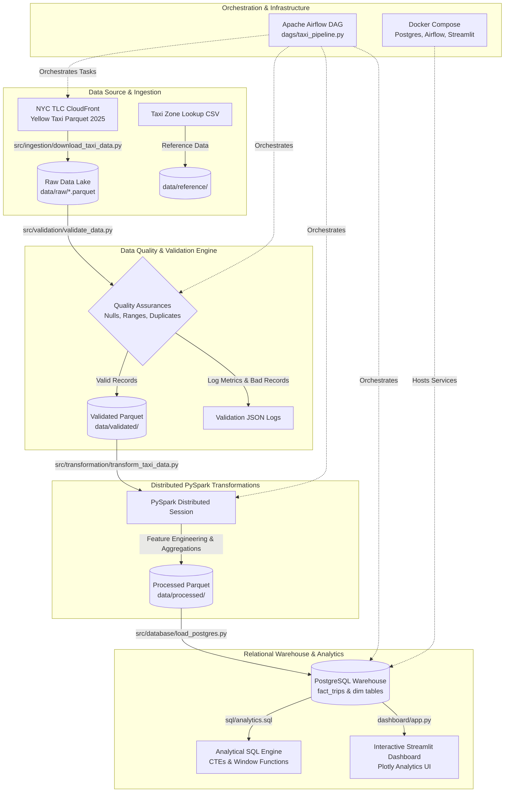

# 🚕 NYC Taxi Data Engineering Pipeline & Analytics Portal

An end-to-end, enterprise-grade Data Engineering pipeline and interactive analytics portal processing official **NYC TLC Yellow Taxi Trip Record Data (2025)** using **PySpark**, **PostgreSQL**, **Apache Airflow**, **Streamlit**, and **Docker**.

Designed as a portfolio project demonstrating large-scale distributed data compute, automated quality assertions, relational warehouse modeling, advanced analytical SQL window functions, high-contrast dashboarding, and cloud-ready modular architecture.

---

## 📊 Key Executive Findings & Urban Analytics (January 2025 Dataset)

| Metric / Insight | Empirical Value | Key Takeaway & Urban Insight |
| :--- | :--- | :--- |
| **Total Validated Volume** | **3,253,091 Trips** | Processed from official 2025 TLC Parquet files after strict data quality assertions. |
| **Gross Monthly Revenue** | **$88,100,357.07** | **$88.10M** gross revenue generated across New York City in January 2025. |
| **Total Driver Tips** | **$10,153,637.67** | **$10.15M** in digital tips collected (~11.5% of total gross revenue). |
| **Average Trip Economics** | **$18.22 Fare \| 5.51 mi \| 15.1 min** | Short intra-city trips dominate the average commute profile. |
| **Peak Demand Hours** | **5:00 PM – 6:00 PM (17:00–18:00)** | Peak rush hour handles **236,509 trips** generating **$6.32M per hour**. |
| **Peak Days of Week** | **Thursday (571.7K) & Friday (544.1K)** | Thursday is NYC's busiest taxi day (66.4% higher trip volume than Monday). |
| **Highest Grossing Zone** | **JFK Airport ($10,914,272.71)** | Generates 3.5x more revenue than Midtown Center ($3.86M) at **$62.64 avg fare**. |
| **Payment & Tip Propensity**| **Credit Card: 74.5% Share** | Credit card terminal prompts achieve a **94.3% tip rate** (26.29% avg tip). |
| **Rush Hour Velocity Penalty**| **18.5 mph Peak vs 26.5 mph Off-Peak** | Midtown grid congestion reduces average speeds to **12.8 mph at 3:00 PM**. |

---

## 🏗️ Architecture Overview



---

## 🛠️ Technology Stack

| Domain | Technology | Purpose |
| :--- | :--- | :--- |
| **Language** | Python 3.12+ | Core development & pipeline execution |
| **Distributed Compute** | Apache Spark (PySpark) | Large-scale feature engineering & aggregations |
| **Data Format** | Apache Parquet & PyArrow | High-performance columnar file storage |
| **Relational Database** | PostgreSQL / SQLite | Data warehousing & analytical queries |
| **Data Validation** | PyArrow & Pydantic | Data quality assertions & metric logging |
| **Orchestration** | Apache Airflow | Pipeline DAG scheduling & task dependencies |
| **Dashboard & UI** | Streamlit & Plotly | Interactive analytics dashboard & visualizations |
| **Containerization** | Docker & Docker Compose | Containerized multi-service deployment |
| **Testing & CI/CD** | Pytest, Flake8, Black, GitHub Actions | Automated linting, verification, and CI/CD |

---

## 🔍 Data Validation Rules & Quality Assurances

The validation engine (`src/validation/validate_data.py`) enforces 7 core data-quality assertions before allowing raw records into PySpark:
1. **Null Timestamps Check**: Rejects records with missing pickup or dropoff datetimes.
2. **Invalid Duration Check**: Rejects trips where dropoff is before pickup or total duration exceeds 24 hours (`duration_minutes > 1440`).
3. **Distance Check**: Rejects trips with `trip_distance <= 0`.
4. **Fare Check**: Rejects negative fares (`fare_amount < 0` or `total_amount < 0`).
5. **Passenger Count**: Filters invalid passenger counts (`passenger_count <= 0` or `passenger_count > 9`).
6. **Spatial Location IDs**: Validates `PULocationID` and `DOLocationID` are within valid NYC TLC range (`1..265`).
7. **Exact Deduplication**: Drops duplicate trip records.

---

## ⚡ Distributed PySpark Transformations

The transformation engine (`src/transformation/transform_taxi_data.py`) calculates key derived fields:
- **`trip_duration_minutes`**: Precise duration in minutes.
- **`avg_speed_mph`**: Calculated trip velocity.
- **`tip_percentage`**: `(tip_amount / fare_amount) * 100`.
- **`pickup_date`, `pickup_hour`, `pickup_day_of_week`**: Temporal feature extractions.
- **`is_peak_hour`**: Boolean flag for NYC weekday rush hours (07:00-09:00 & 16:00-19:00).
- **Aggregations**: Computes distributed summaries for hourly, daily, monthly, and zone performance metrics.

---

## 🗄️ Data Warehouse Schema (`fact_trips` & `dim_taxi_zone`)

```text
                  +-------------------+
                  |   dim_taxi_zone   |
                  +-------------------+
                  | location_id (PK)  |
                  | borough           |
                  | zone              |
                  | service_zone      |
                  +---------+---------+
                            |
                            | 1:N
                            v
+------------------+      +-------------------+
|     dim_date     |      |    fact_trips     |
+------------------+      +-------------------+
| date_key (PK)    |<----+| trip_id (PK)      |
| year             | 1:N  | pulocation_id(FK) |
| month            |      | dolocation_id(FK) |
| day              |      | pickup_datetime   |
| day_name         |      | dropoff_datetime  |
| is_weekend       |      | trip_distance     |
+------------------+      | fare_amount       |
                          | total_amount      |
                          | tip_percentage    |
                          | avg_speed_mph     |
                          +-------------------+
```

---

## 📈 Analytical SQL Queries (`sql/analytics.sql`)

The project includes 13 advanced SQL analytical queries using **CTEs** and **Window Functions**:
1. **Most Popular Month**: Identifies peak trip volume months.
2. **Top Revenue Month**: Computes highest grossing monthly period.
3. **Busiest Hours**: Evaluates hourly demand distribution with window percentages (`SUM OVER ()`).
4. **Day-of-Week Volume**: Aggregates demand patterns across weekdays vs weekends.
5. **Top Pickup Zones**: Ranks busiest pickup locations via `DENSE_RANK() OVER`.
6. **Most Profitable Zones**: Ranks zones by total revenue and average fare per trip.
7. **Distance & Speed Breakdown**: Compares peak vs off-peak average speeds.
8. **Payment Method Analysis**: Aggregates fare and tip metrics across credit card, cash, and dispute payments.
9. **Tip Propensity**: Calculates overall percentage of tipped trips and average tip rates.
10. **Trip Duration Statistics**: Evaluates min, max, and average trip lengths.
11. **Month-over-Month (MoM) Revenue Growth**: Uses `LAG(revenue, 1) OVER (ORDER BY month)` to measure revenue velocity.
12. **Top 10 Origin-Destination Routes**: Ranks busiest zone pairs.
13. **Airport Trip Intelligence**: Categorizes JFK, Newark, and LaGuardia trips via zone & rate code lookups.

---

## 🖥️ Streamlit Interactive Dashboard

Launch the interactive dashboard to visualize metrics and explore taxi demand:

```bash
make dashboard
# Or directly:
streamlit run dashboard/app.py
```

### Dashboard Features:
- **KPI Grid**: Total Trips, Gross Revenue, Avg Fare, Distance, Duration, Tip %.
- **Pill Navigation Menu**: `📊 Executive Overview`, `📍 Spatial & Zone Analytics`, `💳 Economics & SQL Workbench`.
- **Plotly Visualizations**: Hourly demand heatmaps, weekly volume curves, zone rankings, payment method pie charts, and speed profiles.
- **Data Explorer & SQL Workbench**: Execute custom SQL queries directly against the PostgreSQL data warehouse.

---

## 🚀 Quickstart & Local Setup

### Prerequisites
- Python 3.12+
- Java 17 (Required for PySpark)
- Docker & Docker Compose (Optional for containerized mode)

### 1. Clone Repository & Install Dependencies
```bash
git clone https://github.com/tsakirisand/nyc-data-project.git
cd nyc-data-project

# Set up Python virtual environment and dependencies
make setup
```

### 2. Copy Environment Template
```bash
cp .env.example .env
```

### 3. Run Pipeline End-to-End Locally
```bash
# Download 2025 Month 1 Yellow Taxi data
make download

# Validate raw data quality
make validate

# Execute PySpark transformation job
make transform

# Load transformed datasets into relational database
make load

# Run analytical SQL queries
make analytics
```

### 4. Run Pytest Test Suite & Linters
```bash
# Run unit tests
make test

# Run code formatting & linting
make lint
```

---

## 🐳 Containerized Deployment with Docker

To start PostgreSQL, Apache Airflow, and Streamlit in a containerized setup:

```bash
# Build and start services in background
make docker-up

# Service URLs:
# - Streamlit Dashboard: http://localhost:8501
# - Airflow Web UI:     http://localhost:8080
# - PostgreSQL:          localhost:5432
```

---

## 📜 License & Acknowledgments

- **Data Credit**: NYC TLC (Taxi & Limousine Commission) for public trip records.
- **License**: MIT License.
